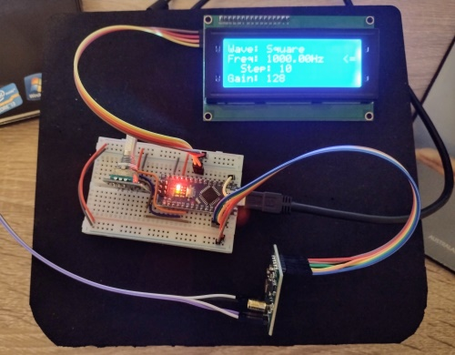

# DFG-ArdAD9833
A Digital Frequency Generator using an Arduino Nano and an AD9833 Module.

This is a quick and easy project to build a 0 - 12.5MHz digital frequency generator!

Features
- Uses a DollaTek AD9833 (+ MCP41010) module (SPI bus).
- Sine, square and triangle wave generation.
- Frequency range 0 - 1.0MHz square and sine waves (software limited for sine waves) - P2 sketch.
- Frequency range 0 - 1.0MHz (square waves) and 0 - 12.5MHz (sine waves) - P3 sketch.
- Frequency range 0 - 1.0MHz (square and triangle waves) and 0 - 12.5MHz (sine waves) - P4 sketch.
- Raw and amplified (with gain control) wave outputs.
- Full control via a KY-040 rotary encoder.
- At a glance settings all on a 20 column x 4 line LCD display (I2C bus).
- Uses open source Arduino libraries for all the hardware modules.

_Blue trace: Raw AD9833 output / Red trace: Amplified output_

 

## Rotary Encoder Controls
- Turn the knob to inc/dec either the frequency or the gain.
- Button long press to toggle frequency or gain control mode.
- Button double-click to cycle through sine, square and triangle wave output.
- Button single click to change the freqency inc/dec step (freq mode).
- Button single click to change the gain low/mid/high setting (gain mode).

## Arduino Sketches
### P1 Sketch
**_FreqGenADMCP-P1.ino_**

Halfway stage: Just the Rotary Encoder and the LCD modules are active.

_This is shown in the accompanying YouTube video (link below)._
### P2 Sketch
**_FreqGenADMCP-P2.ino_**

Complete: The DollaTek AD9833 and MCP41010 module is also active.

_This is shown in the accompanying YouTube video (link below)._
### P3 Sketch
**_FreqGenADMCP-P3.ino_**

Update 1: The DollaTek AD9833 and MCP41010 module with up to 1.0MHz square and 12.5MHz sine waves.

_This update was completed after the YouTube video was made._
### P4 Sketch
**_FreqGenADMCP-P4.ino_**

Update 2: The DollaTek AD9833 and MCP41010 module with up to 1.0MHz square and triangle waves, and 12.5MHz sine waves.

_This update was completed after the YouTube video was made._

## Hardware
- Arduino Nano (my go-to Arduino board for quick projects).
- DollaTek AD9833 frequency generator module with onboard MCP41010 and op-amp.
  * https://www.amazon.co.uk/dp/B07DJT8Z49?psc=1&ref=ppx_yo2ov_dt_b_product_details
    
  
  
- KY-040 rotary encoder module.
  
  
- HD44780 based 20x4 LCD display.
  
  
- HW-061 I2C to HD44780 piggyback module.
- Owon VDS1022i USB oscillosope with open source software.
  * https://github.com/florentbr/OWON-VDS1022 

## Circuit Design
**_WaveGenAD9833v3.fzz_**

## Example Waveforms
### Sine Wave (500kHz)
_Blue trace: Raw AD9833 output / Red trace: Amplified output_

### Sine Wave (2.5MHz)
_Blue trace: Raw AD9833 output / Yellow trace: Amplified output_

### Sine Wave (4.0MHz)
_Blue trace: Raw AD9833 output / Yello trace: Amplified output_

### Square Wave (500kHz)
_Blue trace: Raw AD9833 output / Red trace: Amplified output_

### Square Wave (1.0MHz)
_Blue trace: Raw AD9833 output / Yellow trace: Amplified output_

### Triangle Wave (1.0MHz)
_Blue trace: Raw AD9833 output / Yellow trace: Amplified output_

## YouTube...
My project build, code explanation (P1 and P2 sketches) and demonstration on an Owon VDS1022i oscilloscope here:
 - https://youtu.be/_xULrCQb5uk

## **_Enjoy!_**
